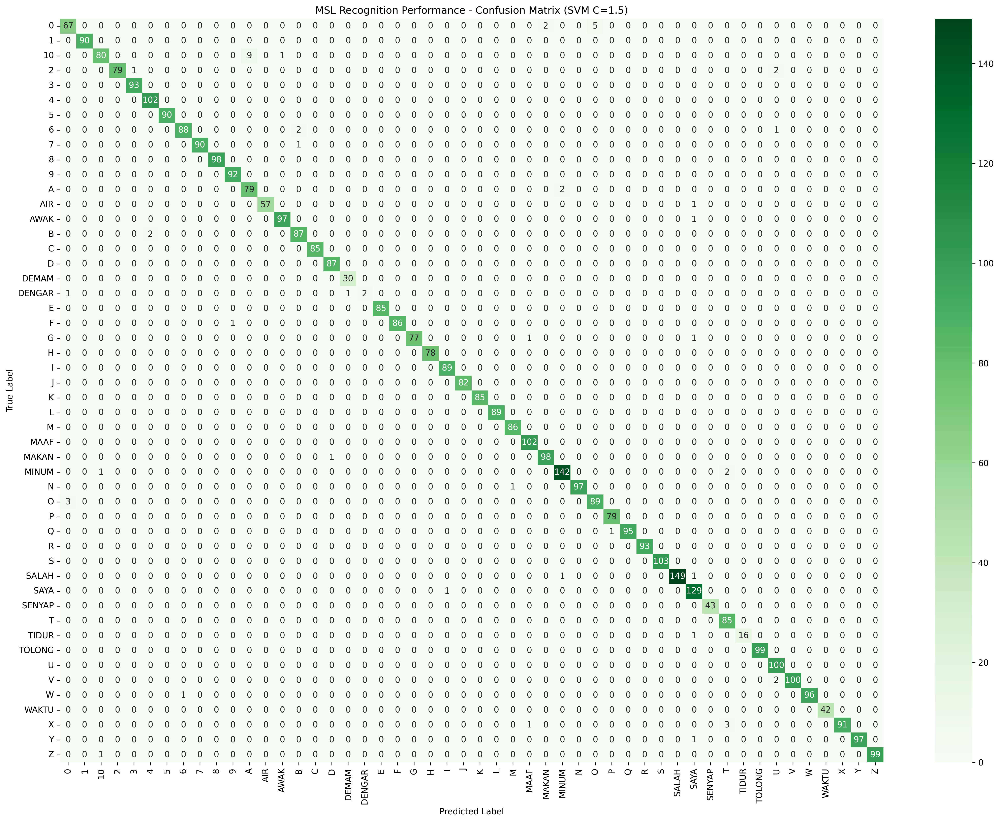

## INtroduction
#### Hardware
Processor: Intel Core i5-1135G7 (11th Gen).

RAM: 16GB DDR4.

Storage: 512GB NVMe SSD.

GPU: Integrated Intel Iris Xe Graphics.

Operating Systems: Arch Linux

## SEtup

#### Folder structure

```
# To replicate our current setup, the folder structure must look like this :
MediSign/
├── CSVs/                 # Folder for extracted landmark data
├── Datasets/             # Source images (Words, V1, V2)
├── Scripts/              # All python scripts and saved models
└── requirements.txt      # Project dependencies

```

```

# Clone the repository
git clone https://github.com/selr1/medisign.git

# Create new conda environment with Python 3.10
conda create -n MediSign_MSL python=3.10 -y

# Activate environment in Fish shell
conda activate MediSign_MSL

# Install all required libraries
pip install -r requirements.txt

```

## Requirements status

#### a) Datasets Selection & Expansion
- We used 2 datasets [MyWSL2023](https://data.mendeley.com/datasets/zvk55p7ktd/1) from Mendeley 
and [Malaysian Sign Language (MSL) Image Dataset](https://www.kaggle.com/datasets/pradeepisawasan/malaysian-sign-language-msl-image-dataset) from Kaggle.
- Preprocess:
  1. [prep.py](Scripts/prep.py) uses recursive search to look for image files, take the parent folder name and use it as the ground truth.
  2. Features are extracted using the MediaPipe Hands module to extract landmarks.
- [validator.py](Scripts/validator.py) was used to determine the validity of obtained CSV ([preprocessed.csv](CSVs/preprocessed.csv))
#### b) Algorithm Implementation
- [trainer.py](Scripts/trainer.py) combined both Random Forest (RF) and Support Vector Machine (SVM) into a single training module. Despite the different mathematical 
approaches, both algorithms achieved >98% accuracy.

#### c) System Development
- [demo.py](Scripts/demo.py) Allow switching between models trained in RF and SVM.

#### d) Experimental Setup
- Experimenting with different parameter settings ; n for RF and C for SVM :
  1. Baseline : 
  | Algorithm | Parameter | Accuracy (%) |
      | ---       | ---      | --- |
      | RF | n=100 | 98.12 |
      | SVM | C=1.0 | 98.09 |
- 
  2. Results :
      | Algorithm | Parameter | Accuracy (%) |
      | ---       | ---      | --- |
      | RF | n=50 | 98.14 |
      | RF | n=150 | 98.12 |
      | SVM | C=0.5 | 97.24 |
      | SVM | C=1.5 | 98.69 |
#### Tuning Graphs - plotted using [graph.py](Scripts/graph.py)

RF


SVM


### Evaluations

#### Confusion Matrix

svm_modelc1.5




## NOtes
#### Training the AI with 2 datasets that displays different type of handsigns was proven to be confusing. 

- Our first dataset only shows standard handsigns meaning the extracted data was only for landmark of hands.
- The second dataset however was a broader type of data meaning it involves interaction of hands with different bodypart such as mouth and stomach.
- Training the AI on a merged dataset extracted from these 2 causes the AI to confuse between the landmark of hands and its interactions witb other bodyparts.

#### Solution : switched to another dataset

- Contain cropped images of single word handsigns related to medical problems.

