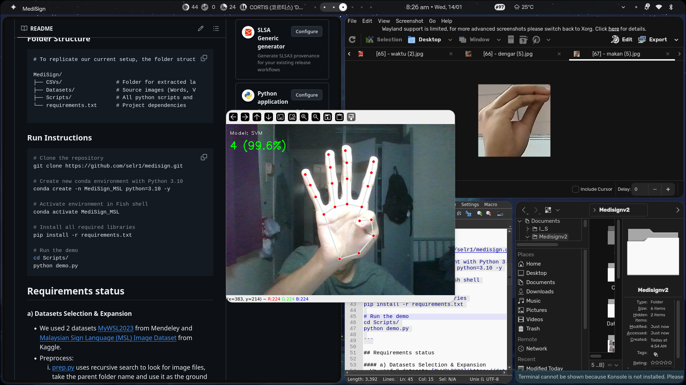

# MediSign


### Quick Start (Must have models ready & files structured correctly)

```bash

# Clone the repository
git clone https://github.com/selr1/medisign.git

# Create new conda environment with Python 3.10
conda create -n medisign python=3.10 -y

# Activate environment in Fish shell
conda activate medisign

# Install all required libraries
pip install -r requirements.txt

# Run the demo
cd Scripts/
python demo.py

```
##### Note: When running the demo, press 'S' to switch between the Random Forest and SVM model, 'Q' to quit.

### Environment
**Processor**: Intel Core i5-1135G7 (11th Gen).

**RAM**: 16GB DDR4.

**Storage**: 512GB NVMe SSD.

**GPU**: Integrated Intel Iris Xe Graphics.

**Operating Systems**: Arch Linux

### Files Structure

```
# To replicate our current setup, the folder structure must look like this :

MediSign/
├── CSVs/                 # Folder for extracted landmark data
├── Datasets/             # Source images (Words, V1, V2)
├── Scripts/              # All python scripts and saved models
└── requirements.txt      # Project dependencies

```

### Requirements Status

#### a) Datasets Selection & Expansion

* Integrated two primary datasets: [MyWSL2023](https://data.mendeley.com/datasets/zvk55p7ktd/1) from Mendeley and the [MSL Image Dataset](https://www.kaggle.com/datasets/pradeepisawasan/malaysian-sign-language-msl-image-dataset) from Kaggle.
* **Preprocessing:**
1. The [prep.py](Scripts/prep.py) script utilizes recursive search to identify image files, automatically assigning the parent folder name as the ground truth label.
2. Utilized the MediaPipe Hands module to extract coordinate landmarks from the processed images.
3. The [validator.py](Scripts/validator.py) script was implemented to verify the integrity and structure of the final [preprocessed.csv](CSVs/preprocessed.csv).

#### b) Algorithm Implementation

* The [trainer.py](Scripts/trainer.py) script uses both **Random Forest (RF)** and **Support Vector Machine (SVM)** in a single training script.
* Despite their distinct mathematical methodologies, both algorithms achieved accuracy exceeding **98%**.

#### c) System Development

* The [demo.py](Scripts/demo.py) application supports live inference and allows users to toggle between RF and SVM models.

#### d) Experimental Setup

* Conducted experiments by adjusting the number of estimators **(n)** for **Random Forest** and the regularization parameter **(C)** for **SVM**.
* These testing provided us with our **best model, ```svm_modelc1.5```**.

**1. Baseline Configuration**

| Algorithm | Parameter | Accuracy (%) |
| --- | --- | --- |
| Random Forest | n=100 | 98.12 |
| Support Vector Machine | C=1.0 | 98.09 |

**2. Optimized Results**

| Algorithm | Parameter | Accuracy (%) |
| --- | --- | --- |
| Random Forest | n=50 | 98.14 |
| Random Forest | n=150 | 98.12 |
| Support Vector Machine | C=0.5  | 97.24 |
| **Support Vector Machine** | **C=1.5** | **98.69** |

### Tuning Graphs

Generated by [graph.py](Scripts/graph.py).

RF


SVM


### Evaluations

**svm_modelc1.5**

#### Confusion Matrix


#### Classification Report


```
              precision    recall  f1-score   support

           0       0.94      0.91      0.92        74
           1       1.00      1.00      1.00        90
          10       0.98      0.89      0.93        90
           2       1.00      0.96      0.98        82
           3       0.99      1.00      0.99        93
           4       0.98      1.00      0.99       102
           5       1.00      1.00      1.00        90
           6       0.99      0.97      0.98        91
           7       1.00      0.99      0.99        91
           8       1.00      1.00      1.00        98
           9       0.99      1.00      0.99        92
           A       0.90      0.98      0.93        81
         AIR       1.00      0.98      0.99        58
        AWAK       0.99      0.99      0.99        98
           B       0.97      0.98      0.97        89
           C       1.00      1.00      1.00        85
           D       0.99      1.00      0.99        87
       DEMAM       0.97      1.00      0.98        30
      DENGAR       1.00      0.50      0.67         4
           E       1.00      1.00      1.00        85
           F       1.00      0.99      0.99        87
           G       1.00      0.97      0.99        79
           H       1.00      1.00      1.00        78
           I       0.99      1.00      0.99        89
           J       1.00      1.00      1.00        82
           K       1.00      1.00      1.00        85
           L       1.00      1.00      1.00        89
           M       0.99      1.00      0.99        86
        MAAF       0.98      1.00      0.99       102
       MAKAN       0.98      0.99      0.98        99
       MINUM       0.98      0.98      0.98       145
           N       1.00      0.99      0.99        98
           O       0.95      0.97      0.96        92
           P       0.99      1.00      0.99        79
           Q       1.00      0.99      0.99        96
           R       1.00      1.00      1.00        93
           S       1.00      1.00      1.00       103
       SALAH       1.00      0.99      0.99       151
        SAYA       0.96      0.99      0.97       130
      SENYAP       1.00      1.00      1.00        43
           T       0.94      1.00      0.97        85
       TIDUR       1.00      0.94      0.97        17
      TOLONG       1.00      1.00      1.00        99
           U       0.95      1.00      0.98       100
           V       1.00      0.98      0.99       102
           W       1.00      0.99      0.99        97
       WAKTU       1.00      1.00      1.00        42
           X       1.00      0.96      0.98        95
           Y       1.00      0.99      0.99        98
           Z       1.00      0.99      0.99       100

    accuracy                           0.99      4351
   macro avg       0.99      0.98      0.98      4351
weighted avg       0.99      0.99      0.99      4351

```

**rf_modeln50**

#### Confusion Matrix


#### Classification Report


```
              precision    recall  f1-score   support

           0       0.97      0.92      0.94        74
           1       1.00      0.99      0.99        90
          10       0.99      0.92      0.95        90
           2       0.95      0.95      0.95        82
           3       0.97      0.99      0.98        93
           4       0.93      0.99      0.96       102
           5       0.99      0.99      0.99        90
           6       0.98      0.98      0.98        91
           7       1.00      1.00      1.00        91
           8       0.98      1.00      0.99        98
           9       1.00      0.99      0.99        92
           A       0.97      0.96      0.97        81
         AIR       0.98      1.00      0.99        58
        AWAK       0.99      1.00      0.99        98
           B       1.00      0.90      0.95        89
           C       0.96      1.00      0.98        85
           D       0.99      1.00      0.99        87
       DEMAM       1.00      1.00      1.00        30
      DENGAR       1.00      0.50      0.67         4
           E       0.98      1.00      0.99        85
           F       1.00      0.97      0.98        87
           G       1.00      0.97      0.99        79
           H       0.99      1.00      0.99        78
           I       1.00      0.97      0.98        89
           J       1.00      1.00      1.00        82
           K       0.97      0.99      0.98        85
           L       0.99      1.00      0.99        89
           M       0.96      1.00      0.98        86
        MAAF       0.99      1.00      1.00       102
       MAKAN       0.98      0.99      0.98        99
       MINUM       0.99      0.99      0.99       145
           N       0.98      0.98      0.98        98
           O       0.95      0.98      0.96        92
           P       0.99      1.00      0.99        79
           Q       1.00      0.99      0.99        96
           R       0.96      0.99      0.97        93
           S       0.98      0.96      0.97       103
       SALAH       1.00      0.99      1.00       151
        SAYA       0.98      1.00      0.99       130
      SENYAP       1.00      1.00      1.00        43
           T       0.99      0.98      0.98        85
       TIDUR       1.00      0.94      0.97        17
      TOLONG       1.00      1.00      1.00        99
           U       0.93      0.94      0.94       100
           V       0.99      0.93      0.96       102
           W       1.00      0.98      0.99        97
       WAKTU       1.00      1.00      1.00        42
           X       0.98      0.99      0.98        95
           Y       0.99      0.99      0.99        98
           Z       0.95      1.00      0.98       100

    accuracy                           0.98      4351
   macro avg       0.98      0.97      0.98      4351
weighted avg       0.98      0.98      0.98      4351

```
### Notes

#### Training the AI with 2 datasets that displays different type of handsigns was proven to be confusing. 

- Our first dataset only shows standard handsigns meaning the extracted data was only for landmark of hands.
- The second dataset however was a broader type of data meaning it involves interaction of hands with different bodypart such as mouth and stomach.
- Training the AI on a merged dataset extracted from these 2 causes the AI to confuse between the landmark of hands and its interactions witb other bodyparts.

#### Solution : switched to another dataset

- Contain cropped images of single word handsigns related to medical problems.

